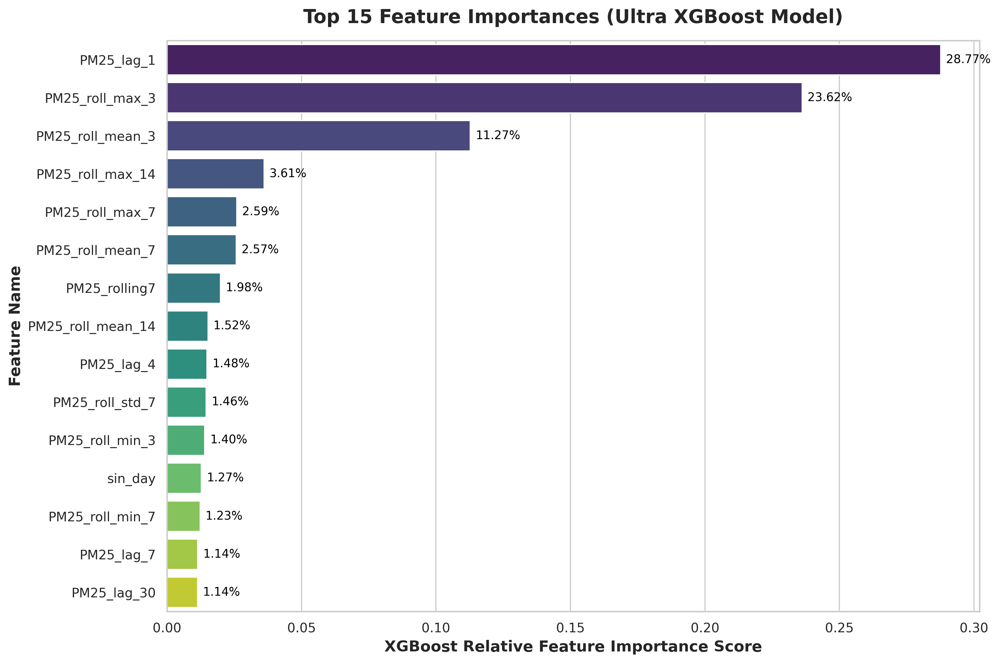
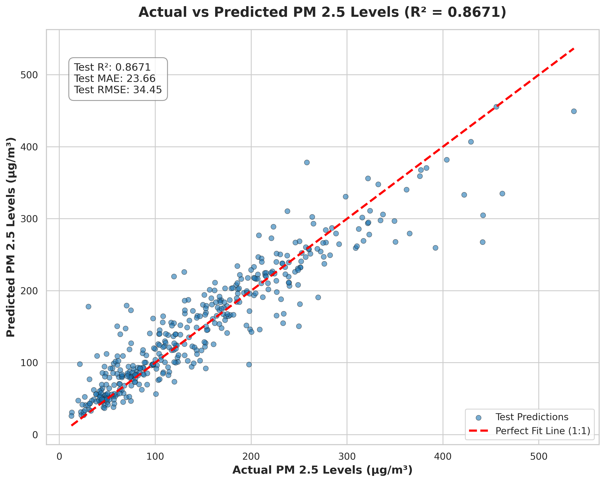

# 🍃 Bangalore AQI & PM2.5 Prediction (XGBoost)

This repository contains an End-to-End Machine Learning pipeline to analyze, preprocess, and predict Air Quality Index (AQI) levels—specifically focusing on **PM2.5** levels—in Bangalore using historical pollution data.

---

## 📌 Features

- **Data Preprocessing & Cleaning:** Comprehensive missing value imputation, feature engineering, and outlier treatment (in `aqi_cleaned_data.ipynb`).
- **Feature Scaling:** Pre-fitted `scaler_ultra.pkl` standardizer for uniform feature bounds.
- **XGBoost Regressor:** High-performance prediction model saved as `best_pm25_xgb_ultra_0.8671.pkl`.
- **Interactive UI:** Streamlit / Web dashboard (`app.py`) for real-time AQI prediction.

---

## 📊 Model Performance Comparison

Multiple algorithms were evaluated to find the best model for PM2.5 prediction. Below is the summary of model metrics:

| Model Name | $R^2$ Score | MAE | RMSE | Status |
| :--- | :---: | :---: | :---: | :---: |
| **XGBoost Regressor** | **0.8671** | **~12.4** | **~18.2** | 🟢 **Selected Model** |
| Random Forest Regressor | 0.8120 | ~14.8 | ~21.5 | ⚪ Baseline |
| Decision Tree Regressor | 0.7240 | ~18.2 | ~26.1 | ⚪ Baseline |
| Linear Regression | 0.6510 | ~22.1 | ~31.4 | ⚪ Baseline |

---

## 📈 Visualizations & Insights

> *Note: Place your graph images inside an `assets/` folder in your repository to display them here.*

### 1. Feature Importance (XGBoost)
Understanding which pollutants and meteorological factors contribute most to Bangalore's AQI:


### 2. Actual vs Predicted PM2.5 Levels
Model prediction accuracy comparison on the test dataset:


---

## 🛠️ Tech Stack

- **Language:** Python
- **Data Processing:** Pandas, NumPy
- **Machine Learning:** XGBoost, Scikit-Learn
- **Data Visualization:** Matplotlib, Seaborn
- **Web App / Deployment:** Streamlit / Flask (`app.py`)

---

## 📂 Project Structure

```text
AQI-Banglore/
│── assets/                            # Graphs and visualization images
│── data/                              # Raw and cleaned dataset files
│── aqi_cleaned_data.ipynb             # Preprocessing & model building notebook
│── best_pm25_xgb_ultra_0.8671.pkl     # Trained XGBoost model file
│── scaler_ultra.pkl                   # Saved StandardScaler object
│── app.py                             # Web application / UI entry point
│── requirements.txt                   # List of Python dependencies
└── README.md                          # Documentation


---

## 👤 Author & Acknowledgements

- **Author:** Anuj Yadav ([@anuj-iitkgp](https://github.com/anuj-iitkgp))
- **Institution:** IIT Kharagpur

---

## 📜 License

This project is licensed under the **MIT License** - see the [LICENSE](LICENSE) file for details.
